<div align="center">



<br/>


<br/>

<a href="mailto:usamanayab505@gmail.com"></a>
<a href="https://www.linkedin.com/in/nayab-usama/"></a>
<a href="https://github.com/nayabusama-ummi?tab=repositories"></a>
<a href="./assets/Nayab_Usama_Full-Stack_Resume.pdf"></a>

<br/><br/>

**Software Engineering graduate (NUML, 2026) based in Multan, Pakistan.**  
I engineer across the full product spectrum — from intuitive UI systems and stateful user flows to scalable REST APIs, relational schemas, RBAC permissions, automated testing, and cloud deployments.

</div>

---

## ⚡ At a glance

<div align="center">

<table>
<tr>
<td align="center" width="25%">
  <b>NOW SHIPPING</b><br/>
  <sub>Software Developer Intern</sub><br/>
  <b>Havit</b>
</td>
<td align="center" width="25%">
  <b>ACTIVE BUILD</b><br/>
  <sub>Client-facing product</sub><br/>
  <b>TSC Lab Platform</b>
</td>
<td align="center" width="25%">
  <b>CORE CRAFT</b><br/>
  <sub>Production engineering</sub><br/>
  <b>Full-Stack + UI</b>
</td>
<td align="center" width="25%">
  <b>APPLIED AI</b><br/>
  <sub>ML &amp; LLM integration</sub><br/>
  <b>Gemini · scikit-learn</b>
</td>
</tr>
</table>

</div>

---

## 🚢 Now shipping

<div align="center">


### TSC Lab — Client-Facing Manufacturing Platform

Engineering a high-performance React application for a **Korean skincare manufacturing &amp; private-label enterprise**.

<table>
<tr>
<td align="center" width="50%">

### `PRODUCT ARCHITECTURE`

**Interactive formulation &amp; quotation experience**

`React 18` · `TypeScript / JS` · `React Router` · `Vite`

Reusable UI systems · responsive layouts · multi-step product inquiries

</td>
<td align="center" width="50%">

### `TEAM DELIVERY`

**Thriving inside high-velocity cross-functional teams**

`ClickUp` · `SQA Testing` · `Marketing` · `Vercel CI/CD`

Rapid iteration · bug isolation · customer feedback integration

</td>
</tr>
</table>

<a href="https://tsc-lab-platform.vercel.app/"></a>

</div>

---

## 📊 Activity & telemetry

<div align="center">

<table>
<tr>
<td align="center" width="50%">
  
</td>
<td align="center" width="50%">
  
</td>
</tr>
<tr>
<td align="center" colspan="2">
  
</td>
</tr>
</table>

</div>

---

## 🚀 Featured engineering

<table>
<tr>
<td align="center" width="50%" valign="top">

### ⌚ NAYAB
**Fine Watchmaking Digital Flagship**

`React` · `TypeScript` · `Node.js` · `Express`  
`Prisma` · `PostgreSQL` · `GSAP`

Transactional checkout · real-time inventory validation  
Guest-to-authenticated cart migration · immutable order snapshots  
Full admin management dashboard · GSAP fluid micro-animations

<br/>

<a href="https://nayab-watches.vercel.app/"></a>

</td>
<td align="center" width="50%" valign="top">

### 🧩 Klyro
**Real-Time Collaborative Workspace**

`React` · `TypeScript` · `Node.js` · `Express`  
`Socket.IO` · `PostgreSQL` · `Prisma`

Multi-role authorization (Owner / Admin / Member)  
Synchronized Kanban board with optimistic concurrency &amp; rollback  
Project task streams · realtime socket subscriptions · 58 Vitest tests

<br/>

<a href="https://klyro-blush.vercel.app/"></a>

</td>
</tr>

<tr>
<td align="center" width="50%" valign="top">

### ☀️ SunGrid
**AI-Powered Solar Marketplace**

`React` · `Python` · `Django REST Framework`  
`PostgreSQL` · `scikit-learn` · `Gemini API`

**56 application screens** · **~40 REST endpoints** · **9 Django models**  
Collaborative filtering recommendation engine  
Random Forest pricing predictions · domain-restricted Gemini copilot

<br/>

<a href="https://sungrid1-nayab-builts.vercel.app/"></a>

</td>
<td align="center" width="50%" valign="top">

### ⚽ FC ULTRA
**Football Analytics &amp; Scouting Intelligence**

`React 18` · `Node.js` · `Express` · `MongoDB`  
`Recharts` · `Three.js`

StatsBomb event data ingestion pipelines  
P25 / P50 / P75 / P90 / P95 percentile benchmarking  
Player comparisons · dynamic shot maps · pass networks  
Interactive WebGL 3D data visualization

<br/>


</td>
</tr>
</table>

---

<details>
<summary align="center"><b>📂 Click to expand more builds — 14th Street Pizza &amp; NovaMart</b></summary>

<br/>

<table>
<tr>
<td align="center" width="50%" valign="top">

### 🍕 14th Street Pizza
**Full-Stack Food Ordering &amp; Brand Experience**

`React` · `TypeScript` · `Vite` · `Node.js` · `Express` · `Zod`

Six-stage dynamic product configurator · responsive ordering UX  
Server-authoritative pricing calculation · 30-test Vitest / Supertest suite

<br/>

<a href="https://14street-pizza-brand-rebuild.vercel.app/"></a>

</td>
<td align="center" width="50%" valign="top">

### 🛒 NovaMart
**Qwetrum Technologies Internship Capstone**

`HTML5` · `CSS3` · `Bootstrap` · `JavaScript`

Full e-commerce catalog · instant multi-parameter filtering &amp; sorting  
Browser-persistent localStorage cart · mobile-first responsive architecture

<br/>


</td>
</tr>
</table>

</details>

---

## 🧰 Production tech stack

<div align="center">


<br/><br/>

<table>
<tr>
<td align="center" width="33%" valign="top">

### 🎨 Frontend

`React 18 / 19`  
`TypeScript`  
`JavaScript (ES6+)`  
`React Router`  
`Vite`  
`Tailwind CSS`  
`GSAP`

</td>
<td align="center" width="33%" valign="top">

### ⚙️ Backend &amp; Data

`Node.js / Express`  
`Django / Django REST`  
`RESTful API Architecture`  
`PostgreSQL`  
`MongoDB`  
`Prisma ORM`  
`Socket.IO`

</td>
<td align="center" width="33%" valign="top">

### 🧠 AI &amp; Tooling

`Google Gemini API`  
`scikit-learn`  
`pandas / NumPy`  
`Collaborative Filtering`  
`Random Forest`  
`Recharts / Three.js`  
`Git / GitHub CI`

</td>
</tr>
</table>

</div>

---

## 💼 Experience timeline

<div align="center">

| Timeline | Organization &amp; Role | Core Deliverables |
|:---:|---|---|
| **Sep 2026 → Present** | **Software Developer Intern · Havit** | Engineered client-facing **TSC Lab** React manufacturing platform |
| **Aug 2026** | **Full-Stack Development Intern · CodeAlpha** | Architected **Klyro** real-time collaborative workspace &amp; RBAC |
| **Aug 2026** | **Full-Stack Development Intern · Decode Lab** | Built **14th Street Pizza** ordering platform &amp; validation engine |
| **Jun 2026** | **Software Development Intern · Qwetrum Technologies** | Developed **NovaMart** e-commerce application &amp; cart state |

</div>

---

## 🤖 Applied AI &amp; modern agentic workflow

<table>
<tr>
<td align="center" width="50%" valign="top">

### 🧠 Product AI Integrations

**Google Gemini API**  
Context-aware, domain-restricted assistant in SunGrid

**Recommendation Systems**  
Collaborative filtering for personalized product matching

**Predictive Analytics**  
Random Forest regression for solar system cost forecasting

`scikit-learn` · `pandas` · `NumPy`

</td>
<td align="center" width="50%" valign="top">

### ⚡ Agent-Accelerated Velocity

**Google Antigravity** · **Cursor** · **OpenCode**

Leveraging AI coding agents for:

`architecture & schema planning`  
`rapid codebase exploration`  
`refactoring & test coverage`  
`deep debugging & SQA`

> *"AI supercharges my iteration speed — rigorous code reviews, automated testing, and product judgment keep the output production-grade."*

</td>
</tr>
</table>

---

## 🔁 Engineering build loop

<div align="center">



</div>

---

## 🕹️ Behind the terminal

<div align="center">

<table>
<tr>
<td width="46%" align="center" valign="middle">


<br/>
<sub><i>“Works on my machine. Packaging my machine for production.”</i></sub>

</td>
<td width="54%" valign="top">

### ☕ The Developer Reality Check

```bash
# Typical development journey:
$ git checkout -b feat/groundbreaking-idea
$ npm run build       # 8 Type errors found
$ fix_typos()         # 12 Type errors found... wait what?
$ brew_coffee()       # Root cause discovered in 3 seconds 💡
$ git commit -m "fix: it works, do not breathe near it"
$ git push origin main 🚀 # All green on CI!
```

**⚡ Dev Confidence Meter:**
* **Building Full-Stack Systems:** `100%`
* **Crushing Production Bugs:** `99%`
* **Centering a `<div>` without Inspect Element:** `404 Not Found` 🔍

</td>
</tr>
</table>

</div>

---

## 🎯 Open to high-impact opportunities

<div align="center">

**Full-Stack Engineering** · **Frontend (React / TypeScript)** · **Backend &amp; API Development (Node / Django)**

<br/>

I thrive in teams building high-impact products where I can take ownership across  
**intuitive product UI · performant APIs · reliable database schemas · clean architecture**

<br/><br/>

<a href="./assets/Nayab_Usama_Full-Stack_Resume.pdf"></a>
<a href="mailto:usamanayab505@gmail.com"></a>
<a href="https://www.linkedin.com/in/nayab-usama/"></a>

<br/><br/>

<sub>Crafted with passion, TypeScript, and excessive amounts of coffee ☕</sub>

</div>
